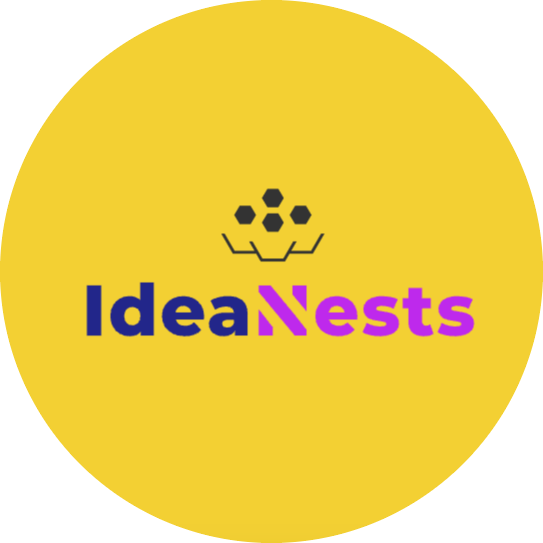

# IdeaNests [(IdeaNests.com)](https://ideanests.com)

**Igniting Ideas, Fostering Change**

Welcome to **IdeaNests**, where your ideas take flight! We're a community-driven platform designed to harness the collective creativity of residents to improve our towns and cities.

## What is IdeaNests?

**IdeaNests** is a unique platform that allows you to share, discuss, and bring to life your ideas for community enhancement. Whether it's improving parks, schools, libraries, or any other local facilities, IdeaNests is here to ensure your voice is heard.

## Key Features

- **Personalized AI Model**: Our advanced AI algorithm analyzes and summarizes submitted ideas, highlighting the ideas that are most representative of the collective community input.
- **Idea Submission**: Easily submit your ideas for various community departments such as Parks & Recreation, Schools, Libraries, and more.
- **Collaborative Platform**: Discuss and improve ideas with input from your fellow residents, fostering a collaborative community environment.
- **Feedback System**: Provide feedback to continually refine ideas and improve the platform.

## Availability

Currently, IdeaNests is available in the towns of Woodbury, Southbury, and Middlebury.

## Get Involved!

Join us in making our community a better place! Your ideas have the power to bring positive change. Visit **IdeaNests** and start sharing your vision for our town's future.

## Contact Us

For more information, questions, or suggestions, please reach out to:

- **Parsh Verma** - parshpune@gmail.com

Let’s build a better community together with **IdeaNests**. Your ideas can make a difference!
